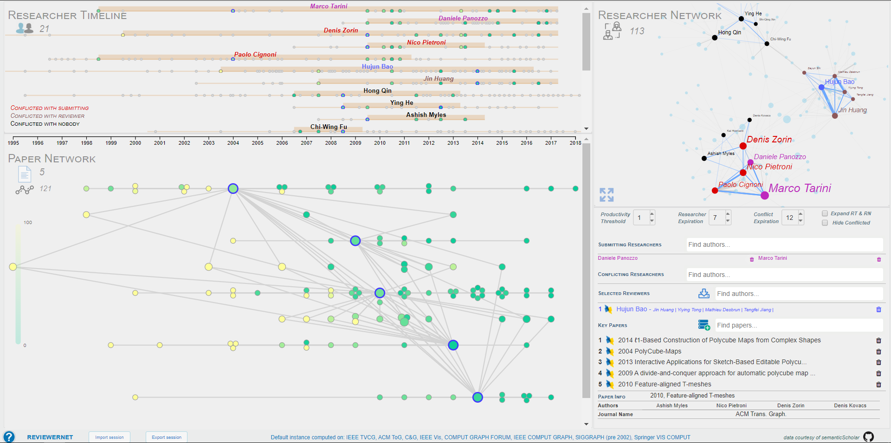

# Table of contents

[1. About ReviewerNet](#about)

[2. The User Interface](#ui)

[3. Visual Variables](#vis)

[4. Actions](#actions)

[5. User-defined parameters and settings](#udps)

[6. How to Use ReviewerNet](#howto)

# About ReviewerNet [to top](#top)

The aim of ReviewerNet is to facilitate the selection of reviewers by journal editors and members of international programme committees. 
Reviewers should be expert on the topic of the submitted paper, while not having conflicts of interest with the submitting authors.

The intuition behind ReviewerNet is that the authors of relevant papers are good candidate reviewers, and that visual representations of citation and co-authorship relations can support the decision making process. ReviewerNet offers an interactive visualization of multiple, coordinated views about papers and researchers that help assessing the expertise and conflict of interest of candidate reviewers. 

ReviewerNet builds on a reference database including papers, authors and citations from selected sources (journal articles and conference papers) taken from the Semantic Scholar Research Corpus. ReviewerNet can be built over any dataset, according to the domain of interest. 

The platform is demonstrated in the field of Computer Graphics. The reference dataset contains data (22.887 papers, 145.900 citations, and 29.549 authors) from eight sources (ACM Transactions on Graphics, Computer Graphics and Applications, Computer Graphics Forum, Computers & Graphics, IEEE Transactions on Visualization and Computer Graphics, Visual Computer, Proceedings of IEEE Conference Visualization pre 2006, Proceedings of ACM SIGGRAPH pre 2003), spanning the years in-between 1995 and 2019. 

Try it at
> http://reviewernet.org  
> *tested browsers: Chrome, Firefox, Safari* 

 

# The User Interface [to top](#top)

There are four regions in the user interface, each resizable in height. The visual composition helps the user to gain different perspectives on the problem at hand, within a single visualization:

1.  The **Paper Network (PN)**, at the bottom-left hand side of the screen, is a graph visualization of the literature related with a submission topic. The nodes represent papers, while the arcs represent in- and out-citation relations between papes. The horizontal dimension represents time. Each key paper is assigned a rectangular region of predefined vertical height; all its citing/cited papers with node degree equal to one are arranged inside the rectangle, whereas nodes with higher degree are positioned in-between the rectangular regions. This visualization of the network enables one to easily detect higher-degree nodes and network cliques, and tell apart relevant papers, which are good candidates for node selection and expansion.
Through graph expansion functionalities, the PN supports the rapid identification of key papers in the literature with respect to the topic of the submitted paper. The intuition is that the authors of key papers form a good set of candidate reviewers.
1.  The **Researcher Timeline (RT)**, at the upper-left side of the screen, is a visualization of the academic career of researchers, through horizontal bars. Each bar represents an author of key papers in the PN. The dots over the bar represent all authored papers in the reference database. The RT helps assessing the suitability of potential reviewers, according for example to topic coverage, productivity over years, and stage of career. Also, visual cues help the user to tell apart candidate reviewers from conflicting researchers.  
1.  The **Researcher Network (RN)**, at the upper-right hand side of the screen, is a graph visualization of co-authorship relations: the nodes represent the authors in the PN and their collaborators in the dataset; the arcs connect authors who have publications in common. The aim of the RN is to visualize the research communities: indeed, the identification of network of collaborators helps looking for sets of independent, non-conflicting reviewers. 
1.  The **Control Panel (CP)**, at the bottom-right hand side of the screen, allows the user to input and manage the names of submitting authors, the names of selected reviewers, and the titles of key papers. The CP area also displays information about papers, upon request. The DBLP icon beside reviewers' names and paper titles links to their respective DBLP page. Finally, the CP includes parameters boxes and checkboxes to fine-tune the visualization. 

# Visual variables [to top](#top)

Visual cues are used to improve the comprehension during interactive sessions. The position, colour, size, boundary, and style of visual elements (nodes, dots, bars, writings) visually represent important characteristics of the entities they stand for. The coherence of visual cues across different views enforces their meaningfulness, and makes it easy for the user to switch between different views without losing focus. 

### Visual cues for Papers 

*   For papers in the PN, the node color may corresponds either to the number of citations received by the paper, from yellow (few citations) to green (many citations) or to or to the venue where it is published - according to the colormap choosen by the user. The corresponding dots in the RT follow the same colormap. Dots corresponding to papers in the reference database, but not included the PN, are marked as grey. 
*   Selected (key) papers are circled in blue, both in the PN and the RT.  Arcs are blue in the RN when the co-authored papers include a selected (key) paper.  

### Visual cues for Researchers 

*   For researchers in the RT, the name coloring emphasizes the distinction between roles: submitting authors (marked as purple), their co-authors (red), selected reviewers (blue), their co-authors (brown), and non-conflicting, candidate reviewers (black). The nodes in the RN corresponding to researchers in the RT follow the same rule, whereas nodes representing their co-authors in the reference database are light blue.   
*   For researchers in the RT, the font style of names further helps to tell apart conflicting researchers (italic) from non-conflicting candidate reviewers (normal). The same colour/font rules apply to the names suggested in the selected reviewers' drop-down menu in the CP.
*   The researchers in the RT are ordered vertically according to a score which counts the number of authored papers, weighted by their importance (i.e., being visualized and/or selected in the PN). The same score is rendered in the RN through the dimension of nodes.  

# Actions [to top](#top)

Each view (PN, RT, RN, CP) is linked to the other views, so that any action in a view is reflected in the others. 

### Actions on Papers

*   When a users focuses on a paper in one of the views by mouse hovering, the same paper is highlighted in the other views. For example, when hovering the mouse over a node in the PN, the corresponding dot in the RT is highlighted, and viceversa. Also, the paper details (title, publication year, venue) are shown in the CP on a mouse click. Likewise, by hovering over or clicking on the title in the CP, the corresponding node and dot are highlighted in the PN and the RT.       
*   When hovering the mouse over an entity representing a paper (a node in the PN, a dot in the RT bars, the title in the CP), the paper authors are highlighted in the RT and RN, if present. A mouse click on the focused paper lets the user navigate the visualization with highlighted items. A single click restores the previous visualization.
*   The icon beside the paper title in the CP links to the DBLP page of the paper. 

### Actions on Researchers

*   In a similar fashion to papers, when a user focuses on a researcher in one of the views by mouse hovering, the same researcher is highlighted in the other views. When hovering the mouse over a node in the RN, the name of the corresponding researcher appears on the upper-right corner.  
*   When hovering the mouse over an entity representing a researcher (a bar in the RT, a dot in the RN, the name in the CP), the papers authored by the researcher are highlighted in the PN view. 
*   A mouse click on a researcher puts the focus on him/her, his/her production and his/her personal net of collaborators. The user can navigate a visualization with selected items and additional functionalities. Only the set of co-authors is visualized in the RT and the RN. While hovering on one of the co-authors, the common publications are shown in the PN, and the arc representing the co-authorship relation is visualized in the RN. Another mouse click will get the user back the previous visualization.
*   When hovering the mouse over an arc in the RT, a pop-up on the upper-right corner shows the pair of co-authors names, the number of common papers in the dataset, and the number of common papers visualized in the PN. In turn, for blue arcs, the common papers are highlighted in the PN. 
*   The icon beside the researcher name in any of the fields in the CP links to the DBLP page of that researcher. 
*   A researcher can be removed from the list of selected reviewers on a double click.

# User-defined parameters and settings [to top](#top)

Users can adjust the number of candidate reviewers visualized through a set of thresholds and options. To limit the number of potential reviewers visualized, the user can set two thresholds a researcher has to meet to be considered as a candidate reviewer, and therefore included in the RT and the RN visualizations: 

*   _Productivity threshold_: the minimum number of authored papers in the PN;
*   _Researcher expiration_: the maximum number of years since the last authored paper included in the reference database.

The user can also remove conflicting authors and their co-authors from the visualization, by ticking the _'Hide Conflicted'_ checkbox.

To augment instead the number of potential reviewers visualized, the user can tick the _'Expand RT & RN'_ checkbox: the visualization will include all the authors of all the papers in the PN, instead of the authors of selected papers only. Note that visualizing a large number of researchers can slow down the interface.

Finally, to modulate the conflict of interest, the user can set a threshold for two researchers to be considered as co-authors, namely _Conflict expiration_: the maximum number of years since the last co-authored paper in the database. A larger threshold will increase the number of candidates marked as conflicted. Conversely, a smaller threshold will increase the number of available reviewers. 

# How to use ReviewerNet [to top](#top)

If you are a journal editor, or an IPC member asked to find additional reviewers, you can follow the steps below to find a set of reviewers for a submitted paper, and alternative reviewers in case of decline. 
Reviewernet runs on a Computer Grapichs instance by default, but you can create your own instance with a user-friendly procedure described [here](https://github.com/cnr-isti-vclab/ReviewerNet/tree/master/parser).

### Step 0: Input the names of submitting and conflicting authors

Input the names of the authors of the submitted paper in the 'Submitting Researchers' field (also with the help of the drop-down menu). You can also input directly the names of conflicting researchers, if known, in the 'Conflicting Researchers' field. The authors are now shown in the RT and the RN, marked as purple (submitting) and red (conflicting). 

### Step 1: Build your Paper Network and select key papers 

The Paper Network includes papers relevant to a submission topic, and their citations. The authors of selected papers in the network define the set of candidate reviewers.

*   Start from one or more seed documents of your choice, say, 1 to 3 papers you deem relevant to the submission topic: input their titles in the 'Key papers' field, and the papers will be included in the PN. Title-based suggestions are shown in a drop-down menu, listed by publication year. Papers already visualized in the PN are highlighted in the drop-down menu.
The user can also press the Import from bibliography button and paste a list of references that will populate the views.
*   Expand the network by selecting interesting nodes, i.e. papers you deem relevant to the topic of the submission, on a mouse double click. The PN then updates with the in- and out-citations of the nodes. The authors of selected (expanded) nodes are now included in the RT and the RN. Selected papers are marked with a blue contour circle, both in the PN and the RT. 
*   Deselect irrelevant nodes, i.e. papers you are no longer interested in, either on a mouse double click on the node or on a mouse click on the thrash button besides the paper title in the list of key papers in the CP. The authors of deselected nodes are removed from the RT and RN. 
*   Continue until you feel the selected papers and their citations offer a good coverage of the literature about the topic at hand. Though there is no limit to the number of selected papers, as a rule of thumb 8 are a good number to benefit from ReviewerNet functionalities.
*   Hovering the mouse over a paper highlights the paper and its authors in all the views. Hovering also works for paper dots in the researcher timeline. A mouse click on a dot lets the user navigate the visualization. A single click restores the previous visualization. The paper details are shown on a mouse click in the bottom right corner. The icon beside the paper links to its DBLP page. 

While you build your set of key papers in the PN, ReviewerNet automatically builds for you the RT and the RN.  Each view is linked to the other views, so that any action in a view is reflected in the others. 

### Step 2: Explore the Researcher Timeline 

The Researcher Timeline (RT) includes the authors of selected key papers in the PN. Researchers are represented as horizontal bars, spanning their academic career. 

*   Explore the RT and use the different handlers to assess the suitability of candidate reviewers: check conflicts thanks to colours and font style; check expertise by looking at stage of career and production over years; check topic coverage by looking at who published what, etc.
*   With a mouse click on a researcher, his/her co-authors are highlighted in the researcher timeline and the researcher network. Hovering on one of the co-authors highlights the common publications in the paper network and the researcher network. Another mouse click will get you back to the previous visualization

### Step 3: Explore the Researcher Network 

The Researcher Network (RN) is a graph visualization of co-authorship relations among the researchers in the RT and their collaborators in the dataset. 

*   Explore the RN and use the different handlers to identify communities of collaborators, and find sets of independent, well distributed reviewers. Pan and zoom are available in the researcher network. The user can switch to full-screen mode by clicking on the icon in the bottom-left part in the RN.
*   Hovering over an element in the researcher network shows a popup with the researcher's name in the upper-right corner. Hovering over an arc highlights the common publications. A gray arc means no shared papers currently visualized. Blue arcs indicate common papers in the paper network.

### Step 4: Select reviewers

*   Once you identified one or more candidate reviewers who fit your requirements, input their names in the 'Selected Reviewers' field (also with the help of the drop-down menu). The colouring of the selected reviewer will switch to blue both in the RT and the RN, and the colouring of his/her co-authors will switch to grey, to identify them as conflicting potential reviewers and tell them apart from the remaining available candidates.
*   A researcher can be removed from the list of selected reviewers on a double click.    
*   Once you select a reviewer, ReviewerNet adds automatically a list of potential alternative reviewers, in case of decline. Alternative reviewers are chosen from the candidate ones, so that they only conflict with the declining reviewer. Substitute reviewers by a mouse click.  
*   Download your list of reviewers with a click on the download button. The list reports reviewers' names and bibliographic references to their papers. 

For further information on how to use ReviewerNet refer to [this paper](http://vcg.isti.cnr.it/Publications/2019/SGPC19/). <!--, have a look at the accompanying video https://youtu.be/JnomPO8QI28 --> 

